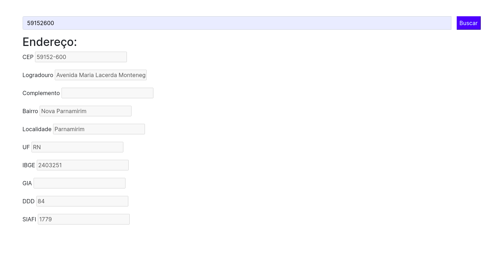

# Consumindo ViaCEP pelo Java 

Amostra de uma aplicação simples usando Spring Boot onde consumo uma API via Java para buscar endereços através do CEP. 

Criei essa aplicação com o objetivo de reforçar as experiências que venho adquirindo como desenvolvedora. 

- Java 17
- Spring Boot 
- gson (Para conversão Json/String -> Entidade)

Vídeo Apresentação: https://www.youtube.com/watch?v=j41r6JJb2iY